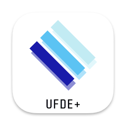

<p align="center">
  <a href="" rel="noopener">
 </a>
</p>

<h3 align="center">UFDE+</h3>

<div align="center">

[]()
[](https://github.com/0xtaruhi/ufde-next/issues)
[](https://github.com/0xtaruhi/ufde-next/pulls)
[](/LICENSE)

</div>

---

<p align="center"> UFDE+ is a new generation of FPGA integrated design environment from synthesis to implementation for Fudan University's self-developed FPGAs.
    <br> 
</p>

## 📝 Table of Contents

- [About](#about)
- [Getting Started](#getting_started)
- [Authors](#authors)

## 🧐 About <a name = "about"></a>

UFDE+ is a new generation of FPGA integrated design environment from synthesis to implementation for Fudan University's self-developed FPGAs. It is designed to be a complete and easy-to-use FPGA design environment. UFDE+ is a cross-platform application based on the Tauri framework, which can run on Windows, Linux and macOS.

## 🏁 Getting Started <a name = "getting_started"></a>

These instructions will get you a copy of the project up and running on your local machine for development and testing purposes. See [deployment](#deployment) for notes on how to deploy the project on a live system.

### Prerequisites

#### Rust & Cargo

Install [Rust](https://www.rust-lang.org/tools/install) and [Cargo](https://doc.rust-lang.org/cargo/getting-started/installation.html) first. Recommended installation method is via [rustup](https://rustup.rs/).

#### pnpm

Install [pnpm](https://pnpm.io/installation) first. Optionally, you can use npm or yarn instead.

### Installing

After cloning the repository, run the following command to install dependencies:

```bash
pnpm install
```

Then, run the following command to start the application:

```bash
pnpm tauri dev
```

This will start the application in development mode. You can also build the application by running the following command:

```bash
pnpm tauri build
```

This will build the application for your current platform. You can find the built application in the `src-tauri/target/release` directory.

## ✍️ Authors <a name = "authors"></a>

- [@0xtaruhi](https://github.com/0xtaruhi) - Initial work